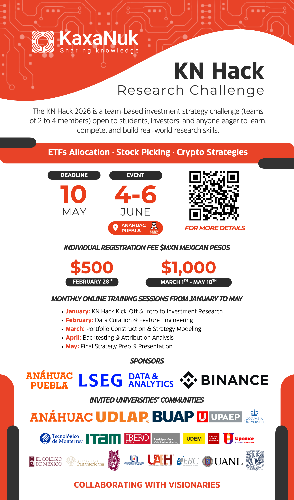

# Research Challenge 2026

The KN Hack 2026 is a team-based investment strategy challenge (teams of 2 to 4 members) open to students, investors, and anyone eager to learn, compete, and build real-world research skills.

# Investment Strategy Example

The `Investment_Strategy_Example/` folder contains a full, runnable stock-picking strategy built on the KaxaNuk framework. It is organized as three sequential steps:

## Step 1 — Data Curator (`run_data_curator.py`)

Downloads market and fundamental data from your configured data providers (Financial Modeling Prep, LSEG Workspace, or Yahoo Finance), runs custom signal calculations (e.g. the 50/200-day SMA crossover signal), and writes enriched per-ticker datasets to `Data_Curator/` as CSV and Parquet files.

Configuration lives in `Config/data_curator_parameters.xlsx`. API keys go in `Config/.env` (copy from `Config/.env_template`).

```bash
cd Investment_Strategy_Example
python run_data_curator.py
```

## Step 2 — Portfolio Construction (`run_portfolio_construction.py`)

Reads the enriched data from `Data_Curator/`, applies selection and sizing rules (liquidity-weighted, signal-filtered, capped at 20% per position), and produces a historical portfolio weights file at `Portfolio_Construction/portfolio_weights.csv`. This lets you validate and inspect the strategy hypothesis before running the full backtest.

```bash
python run_portfolio_construction.py
```

## Step 3 — Backtest Engine (`run_backtest_engine.py`)

Uses the KaxaNuk Backtest Engine library to run a historical simulation over the portfolio weights produced in Step 2. Configuration lives in `Config/backtest_engine_parameters.xlsx`. Results and a performance dashboard are written to `Backtest_Engine/`.

```bash
python run_backtest_engine.py
```

## Setup

Install dependencies (Python >=3.12, <3.15 required):

```bash
pip install kaxanuk.data_curator kaxanuk.data_curator_extensions.yahoo_finance
```

```bash
pip install kaxanuk-backtest-engine --extra-index-url https://license:LIC-XXXX
```

Copy the environment template and fill in your API keys:

```bash
cp Config/.env_template Config/.env
# then edit Config/.env with your keys
```

---

# Sessions Videos

S01 KN Hack Kick-Off & Intro to Investment Research: https://www.youtube.com/watch?v=_jBLqYBaP-I

S02 Data Curation & Feature Engineering: https://www.youtube.com/watch?v=vydafB8UM9g

LSEG Workspace + KN Data Curator: https://youtu.be/6Au0RWgojpE

S03 Portfolio Construction & Strategy Modeling: https://youtu.be/S5bPxSiq4II

# Event Details

By registering individually, you will receive all event information and payment instructions directly to your email.

Registration form: https://docs.google.com/forms/d/e/1FAIpQLSf0E0blgT9a3K3JQe_ldihpFk7KIShldXG89MBIH2xRegTKFw/viewform

📅Event Details

Challenge Dates: June 4–6, 2026

Location: Universidad Anahuac Puebla

🕒Registration Fee (Individual):

  - MXN $500 — Early Bird (until February 28)
  - MXN $1,000 — Regular (March 1 to May 10, 2026)

🔥Limited Capacity: Only 100 teams (up to 400 participants).

Secure your spot early!

📚Monthly Online Training Sessions (Jan–May 2026)

Participants will automatically receive calendar invites and study materials.

- January: KN Hack Kick-Off & Intro to Investment Research
- February: Data Curation & Feature Engineering
- March: Portfolio Construction & Strategy Modeling
- April: Backtesting & Attribution Analysis
- May: Final Strategy Prep & Presentation

💡Topics You Can Hack

  - ETFs Asset Allocation
  - Stock Picking
  - Crypto Strategies

Questions: research@kaxanuk.mx 

KN Hack: https://www.kaxanuk.mx/kn-hack


